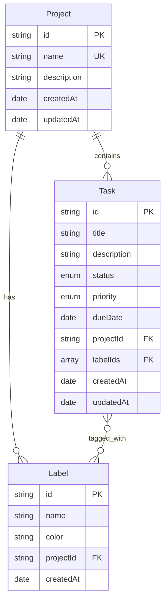

# TODO List REST API

Production-ready TODO List REST API built with **Fastify + MongoDB** using **Clean Architecture**, **SOLID**, and **DRY** principles.

> [!TIP]
> **New to the project?** Check out our comprehensive [Architecture Guide](./docs/ARCHITECTURE_GUIDE.md) for a deep dive into the design principles, request flows, and a step-by-step tutorial on adding new features.


## Features

- ✅ Full CRUD for Projects, Tasks, and Labels
- ✅ Clean Architecture (Domain → Application → Infrastructure → Interface)
- ✅ SOLID & DRY principles throughout
- ✅ Cursor-based pagination for Tasks, offset pagination for Projects/Labels
- ✅ Advanced filtering and sorting
- ✅ OpenAPI/Swagger documentation
- ✅ Comprehensive test suite (>85% coverage target)
- ✅ Request correlation IDs for tracing
- ✅ Typed error handling with HTTP mapping

## Tech Stack

| Tool | Version | Purpose |
|------|---------|---------|
| Node.js | 20+ LTS | Runtime |
| Fastify | 5.x | Web framework |
| MongoDB | 7.x | Database (native driver) |
| TypeScript | 5.x | Type safety |
| Vitest | 2.x | Testing |
| Biome | 2.x | Linting & formatting |
| pnpm | Latest | Package manager |

## Quick Start

### Prerequisites

- Node.js 20+
- pnpm
- Docker (for integration tests and local MongoDB)

### Installation

```bash
# Clone the repository
cd fastify-clean-arch-api-todolist

# Install dependencies
pnpm install

# Copy environment file
cp .env.example .env

# Start MongoDB (via Docker)
docker run -d -p 27017:27017 --name mongodb mongo:7

# Run in development mode
pnpm dev
```

### Available Scripts

| Script | Description |
|--------|-------------|
| `pnpm dev` | Start development server with hot reload |
| `pnpm build` | Build TypeScript to JavaScript |
| `pnpm start` | Run production build |
| `pnpm test` | Run all tests |
| `pnpm test:unit` | Run unit tests only |
| `pnpm test:integration` | Run integration tests (requires Docker) |
| `pnpm test:coverage` | Run tests with coverage report |
| `pnpm lint` | Check for linting issues |
| `pnpm lint:fix` | Fix linting issues |
| `pnpm format` | Format code |

## API Documentation

Once running, access the interactive API docs at: **http://localhost:3000/docs**

### Endpoints Summary

#### Projects `/projects`
| Method | Endpoint | Description |
|--------|----------|-------------|
| POST | `/projects` | Create a project |
| GET | `/projects` | List all projects (paginated) |
| GET | `/projects/:id` | Get project by ID |
| PATCH | `/projects/:id` | Update a project |
| DELETE | `/projects/:id` | Delete a project (use `?force=true` for projects with tasks) |

#### Tasks `/tasks`
| Method | Endpoint | Description |
|--------|----------|-------------|
| POST | `/tasks` | Create a task |
| GET | `/tasks` | List tasks with filtering, pagination, sorting |
| GET | `/tasks/:id` | Get task by ID |
| PATCH | `/tasks/:id` | Update a task |
| DELETE | `/tasks/:id` | Delete a task |

**Task Filters:**
- `projectId` - Filter by project
- `status` - Filter by status (todo, in_progress, done, cancelled)
- `priority` - Filter by priority (low, medium, high, urgent)
- `labelIds` - Filter by labels
- `dueDateFrom` / `dueDateTo` - Filter by due date range
- `search` - Text search in title/description
- `sortField` / `sortOrder` - Sorting

#### Labels `/labels`
| Method | Endpoint | Description |
|--------|----------|-------------|
| POST | `/labels` | Create a label |
| GET | `/labels?projectId=x` | List labels for a project |
| GET | `/labels/:id` | Get label by ID |
| PATCH | `/labels/:id` | Update a label |
| DELETE | `/labels/:id` | Delete a label |

## Architecture Overview

```
src/
├── domain/           # Core business logic (entities, errors, types)
│   ├── entities/     # Project, Task, Label entities
│   ├── errors/       # Domain-specific errors
│   └── types/        # Shared types (TaskStatus, pagination, etc.)
│
├── application/      # Use cases and port interfaces
│   ├── ports/        # Repository interfaces (dependency inversion)
│   └── use-cases/    # Business operations organized by entity
│
├── infrastructure/   # External implementations
│   ├── database/     # MongoDB connection
│   ├── repositories/ # Repository implementations
│   └── mappers/      # Entity ↔ Document mappers
│
├── interfaces/       # HTTP layer
│   └── http/
│       ├── app.ts        # Fastify app factory
│       ├── container.ts  # DI container
│       ├── routes/       # Route handlers
│       ├── dtos/         # Request/Response schemas
│       └── middleware/   # Error handler, correlation ID
│
└── config/           # Environment config with validation
```

## Domain Model



## Testing

### Running Tests

```bash
# Run all tests
pnpm test

# Run unit tests only (no Docker required)
pnpm test:unit

# Run integration tests (requires Docker for Testcontainers)
pnpm test:integration

# Generate coverage report
pnpm test:coverage
```

### Test Structure

```
tests/
├── unit/
│   ├── domain/           # Entity invariant tests
│   └── application/      # Use case tests (mocked repos)
├── integration/
│   └── routes/           # HTTP endpoint tests
└── helpers/
    ├── test-builders.ts  # Entity factories
    └── test-db.ts        # Testcontainers setup
```

## Environment Variables

| Variable | Description | Default |
|----------|-------------|---------|
| `PORT` | Server port | `3000` |
| `HOST` | Server host | `0.0.0.0` |
| `NODE_ENV` | Environment | `development` |
| `MONGODB_URI` | MongoDB connection string | `mongodb://localhost:27017` |
| `MONGODB_DATABASE` | Database name | `todolist` |
| `LOG_LEVEL` | Logging level | `info` |

## Troubleshooting

### MongoDB Connection Issues
```bash
# Check if MongoDB is running
docker ps | grep mongo

# Start MongoDB
docker run -d -p 27017:27017 --name mongodb mongo:7
```

### Integration Tests Failing
- Ensure Docker is running (required for Testcontainers)
- Check available disk space
- Try `docker system prune` to clean up

### Port Already in Use
```bash
# Find process using port 3000
lsof -i :3000

# Kill the process
kill -9 <PID>
```

## License

MIT
