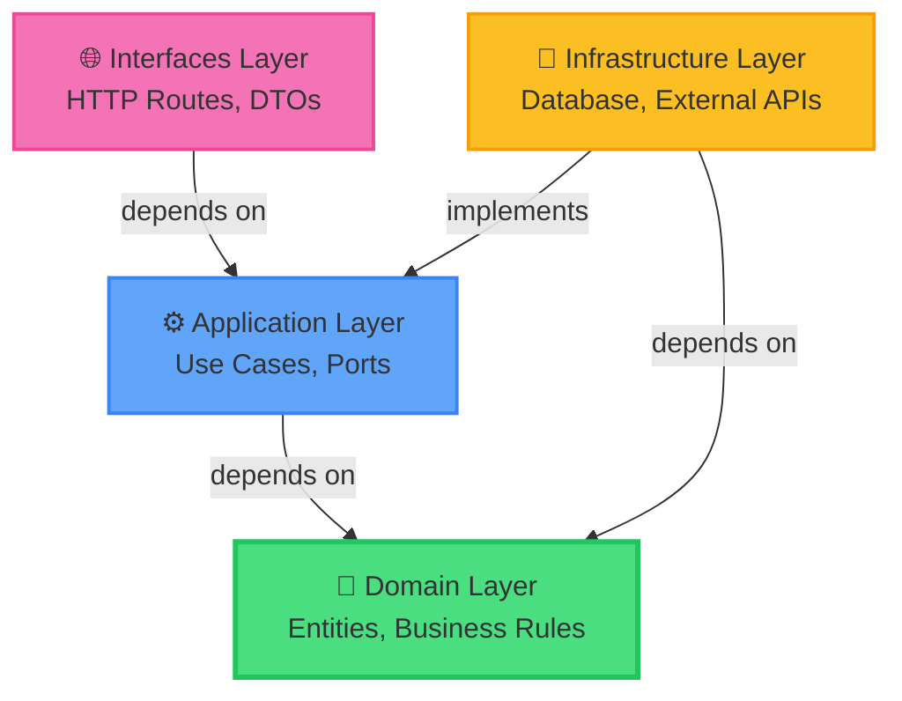
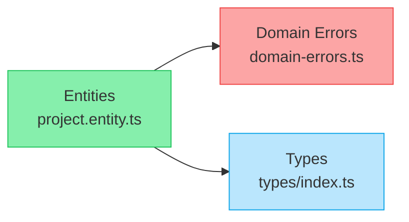
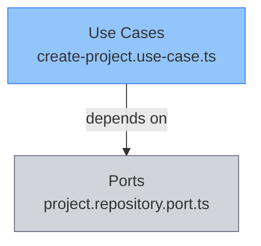
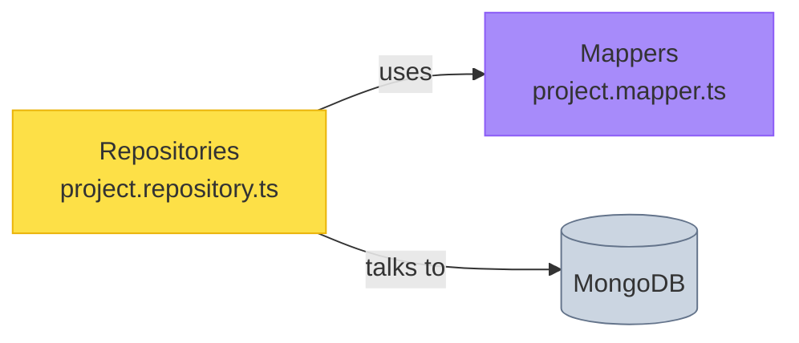
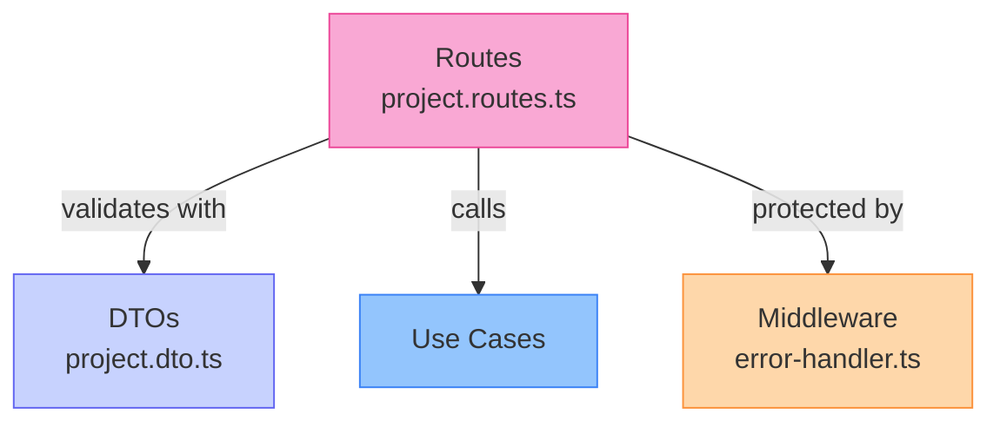
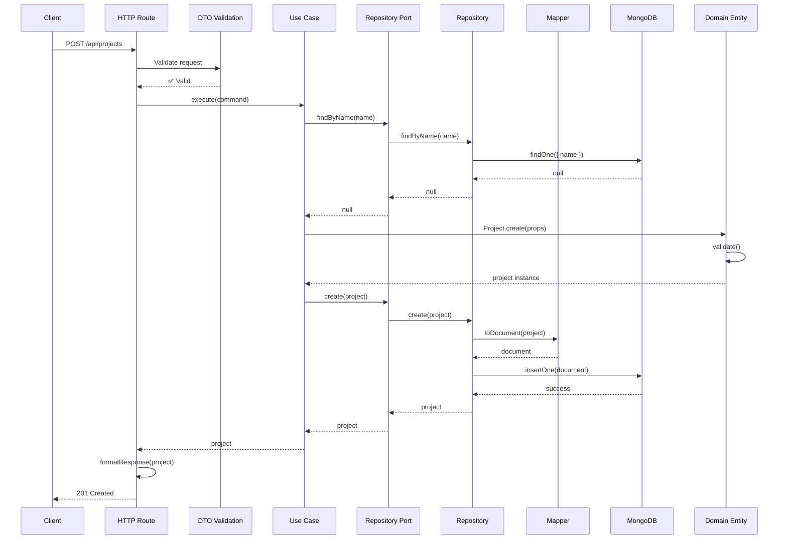
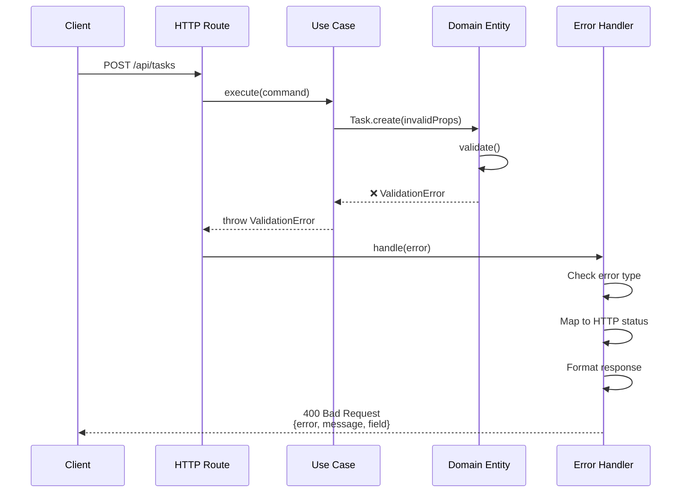
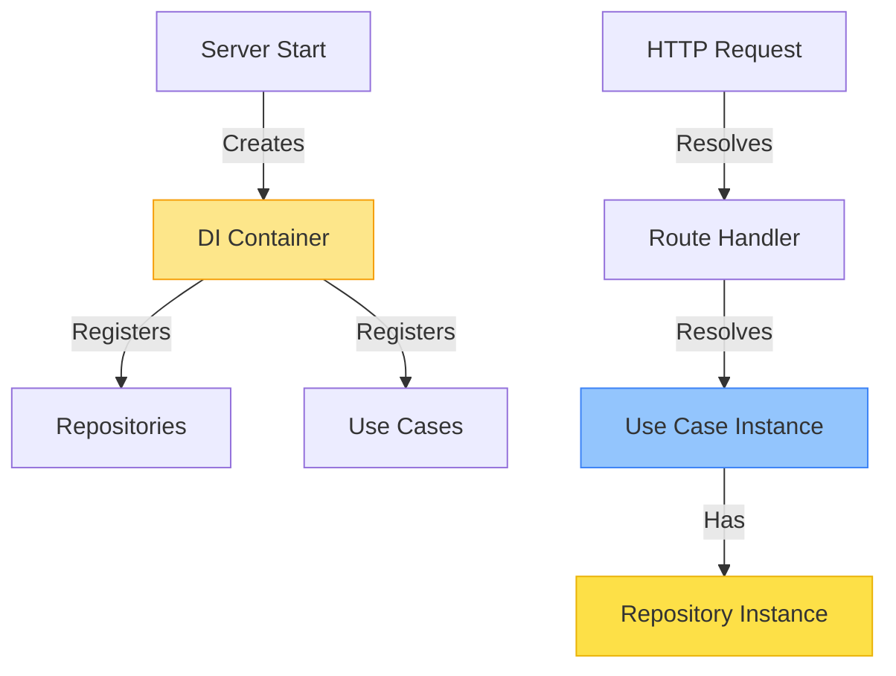
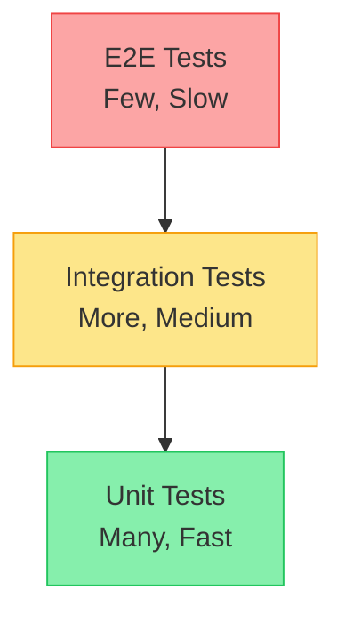

# Clean Architecture Guide

> A comprehensive guide to understanding and extending the TODO List REST API

## Table of Contents

1. [Introduction](#introduction)
2. [Architecture Overview](#architecture-overview)
3. [Layer Interactions](#layer-interactions)
4. [Request Flow Diagrams](#request-flow-diagrams)
5. [Adding a New CRUD Feature](#adding-a-new-crud-feature)
6. [Best Practices](#best-practices)
7. [Testing Strategy](#testing-strategy)

---

## Introduction

This project follows **Clean Architecture** principles, ensuring:
- **Independence**: Business logic is independent of frameworks, UI, and databases
- **Testability**: Core business rules can be tested without external dependencies
- **Maintainability**: Changes in one layer don't affect others
- **Scalability**: Easy to add new features without breaking existing code

### Key Principles

1. **Dependency Rule**: Dependencies point inward. Outer layers depend on inner layers, never the reverse.
2. **Separation of Concerns**: Each layer has a single, well-defined responsibility.
3. **Dependency Inversion**: High-level modules don't depend on low-level modules. Both depend on abstractions.

---

## Architecture Overview

### Layer Structure

```
src/
├── domain/              # Enterprise Business Rules (Core)
├── application/         # Application Business Rules (Use Cases)
├── infrastructure/      # Frameworks & Drivers (Database, External Services)
├── interfaces/          # Interface Adapters (HTTP, CLI, etc.)
└── config/             # Configuration
```

### Dependency Flow



### Path Aliases

The project uses TypeScript path aliases for cleaner imports:

| Alias | Maps to | Usage |
|-------|---------|-------|
| `@domain/*` | `src/domain/*` | Core entities, errors, types |
| `@app/*` | `src/application/*` | Use cases, ports |
| `@infra/*` | `src/infrastructure/*` | Repositories, mappers |
| `@interface/*` | `src/interfaces/*` | HTTP routes, DTOs |
| `@config/*` | `src/config/*` | Configuration |

**Example:**
```typescript
// ✅ Good - Using path aliases
import { Project } from '@domain/entities/project.entity.js';

// ❌ Avoid - Relative paths
import { Project } from '../../../domain/entities/project.entity.js';
```

---

## Layer Interactions

### 1. Domain Layer (Core)

**Location:** `src/domain/`

**Purpose:** Contains pure business logic and rules. No external dependencies.



**Components:**

- **Entities** (`entities/`): Business objects with identity and behavior
  - Example: `Project`, `Task`, `Label`
  - Enforce invariants (e.g., task title cannot be empty)
  - State transitions (e.g., task status machine)

- **Errors** (`errors/`): Domain-specific exceptions
  - `ValidationError`: Invalid data
  - `NotFoundError`: Resource doesn't exist
  - `ConflictError`: Duplicate resource
  - `BusinessRuleViolationError`: Rule violations

- **Types** (`types/`): Shared types and enums
  - `TaskStatus`, `TaskPriority`
  - Pagination types

**Example Entity:**
```typescript
// src/domain/entities/project.entity.ts
export class Project extends Entity<ProjectProps> {
  private constructor(props: ProjectProps, id?: string) {
    super(props, id);
    this.validate();
  }

  static create(props: ProjectProps, id?: string): Project {
    return new Project(props, id);
  }

  private validate(): void {
    if (!this.props.name || this.props.name.trim().length === 0) {
      throw new ValidationError('Project name cannot be empty', 'name');
    }
  }
}
```

### 2. Application Layer (Use Cases)

**Location:** `src/application/`

**Purpose:** Orchestrates business logic. Contains application-specific rules.



**Components:**

- **Use Cases** (`use-cases/`): Application operations
  - One class per operation (e.g., `CreateProjectUseCase`)
  - Orchestrates domain entities
  - Implements business workflows

- **Ports** (`ports/`): Interfaces for external dependencies
  - Repository interfaces
  - Defines contracts, no implementation

**Example Use Case:**
```typescript
// src/application/use-cases/project/create-project.use-case.ts
export class CreateProjectUseCase {
  constructor(private readonly projectRepository: ProjectRepositoryPort) {}

  async execute(command: CreateProjectCommand): Promise<Project> {
    // Check for duplicates
    const existing = await this.projectRepository.findByName(command.name);
    if (existing) {
      throw new ConflictError('Project', 'name', command.name);
    }

    // Create entity
    const project = Project.create({
      name: command.name,
      description: command.description,
    });

    // Persist
    return this.projectRepository.create(project);
  }
}
```

### 3. Infrastructure Layer (Adapters)

**Location:** `src/infrastructure/`

**Purpose:** Implements ports, handles external systems (database, APIs).



**Components:**

- **Repositories** (`repositories/`): Implement repository ports
  - Concrete implementation for data access
  - Uses native MongoDB driver
  - Handles filtering, pagination, sorting

- **Mappers** (`mappers/`): Transform between layers
  - Domain Entity ↔ Database Document
  - Ensures domain layer stays pure

**Example Repository:**
```typescript
// src/infrastructure/repositories/project.repository.ts
export class ProjectRepository implements ProjectRepositoryPort {
  constructor(private readonly db: Db) {
    this.collection = db.collection<ProjectDocument>('projects');
  }

  async create(project: Project): Promise<Project> {
    const document = ProjectMapper.toDocument(project);
    await this.collection.insertOne(document);
    return project;
  }

  async findById(id: string): Promise<Project | null> {
    const doc = await this.collection.findOne({ _id: id });
    return doc ? ProjectMapper.toDomain(doc) : null;
  }
}
```

### 4. Interfaces Layer (Controllers)

**Location:** `src/interfaces/http/`

**Purpose:** Handles HTTP requests, validation, and responses.



**Components:**

- **Routes** (`routes/`): HTTP endpoint handlers
  - Define REST endpoints
  - Validate requests
  - Call use cases
  - Format responses

- **DTOs** (`dtos/`): Data Transfer Objects
  - TypeBox schemas for validation
  - Request/response types
  - OpenAPI documentation

- **Middleware**: Cross-cutting concerns
  - Error handling
  - Correlation IDs
  - CORS, Helmet, Swagger

**Example Route:**
```typescript
// src/interfaces/http/routes/project.routes.ts
export async function projectRoutes(
  fastify: FastifyInstance,
  container: AwilixContainer
) {
  // Create project
  fastify.post<{ Body: CreateProjectBody }>(
    '/',
    {
      schema: {
        body: CreateProjectBodySchema,
        response: { 201: ProjectResponseSchema },
      },
    },
    async (request, reply) => {
      const useCase = container.resolve<CreateProjectUseCase>('createProjectUseCase');
      const project = await useCase.execute(request.body);
      return reply.code(201).send(formatProjectResponse(project));
    }
  );
}
```

---

## Request Flow Diagrams

### Complete Request Flow



### Error Handling Flow



### Dependency Injection Flow



---

## Adding a New CRUD Feature

Let's walk through adding a **Category** entity with full CRUD operations.

### Step 1: Define Domain Entity

**File:** `src/domain/entities/category.entity.ts`

```typescript
import { Entity } from '@domain/shared/entity.js';
import { ValidationError } from '@domain/errors/domain-errors.js';

export interface CategoryProps {
  name: string;
  description?: string;
  color: string;
  projectId: string;
  createdAt: Date;
  updatedAt: Date;
}

export class Category extends Entity<CategoryProps> {
  private constructor(props: CategoryProps, id?: string) {
    super(props, id);
    this.validate();
  }

  static create(
    input: Omit<CategoryProps, 'createdAt' | 'updatedAt'>,
    id?: string
  ): Category {
    const now = new Date();
    return new Category(
      {
        ...input,
        createdAt: now,
        updatedAt: now,
      },
      id
    );
  }

  update(updates: Partial<Pick<CategoryProps, 'name' | 'description' | 'color'>>): void {
    if (updates.name !== undefined) {
      this.props.name = updates.name;
    }
    if (updates.description !== undefined) {
      this.props.description = updates.description;
    }
    if (updates.color !== undefined) {
      this.props.color = updates.color;
    }
    this.props.updatedAt = new Date();
    this.validate();
  }

  private validate(): void {
    if (!this.props.name?.trim()) {
      throw new ValidationError('Category name cannot be empty', 'name');
    }
    if (!this.props.color?.match(/^#([A-Fa-f0-9]{6})$/)) {
      throw new ValidationError('Invalid color format. Use hex format like #FF5733', 'color');
    }
  }

  // Getters
  get name(): string { return this.props.name; }
  get description(): string | undefined { return this.props.description; }
  get color(): string { return this.props.color; }
  get projectId(): string { return this.props.projectId; }
  get createdAt(): Date { return this.props.createdAt; }
  get updatedAt(): Date { return this.props.updatedAt; }

  toJSON() {
    return {
      id: this.id,
      name: this.name,
      description: this.description,
      color: this.color,
      projectId: this.projectId,
      createdAt: this.createdAt,
      updatedAt: this.updatedAt,
    };
  }
}
```

### Step 2: Define Repository Port

**File:** `src/application/ports/category.repository.port.ts`

```typescript
import type { Category } from '@domain/entities/category.entity.js';
import type { OffsetPaginatedResult, OffsetPaginationParams } from '@domain/types/index.js';

export interface CategoryRepositoryPort {
  create(category: Category): Promise<Category>;
  findById(id: string): Promise<Category | null>;
  findByName(name: string, projectId: string): Promise<Category | null>;
  findByProjectId(
    projectId: string,
    params: OffsetPaginationParams
  ): Promise<OffsetPaginatedResult<Category>>;
  update(category: Category): Promise<Category>;
  delete(id: string): Promise<void>;
  deleteByProjectId(projectId: string): Promise<void>;
}
```

### Step 3: Create Use Cases

**File:** `src/application/use-cases/category/create-category.use-case.ts`

```typescript
import type { CategoryRepositoryPort } from '@app/ports/category.repository.port.js';
import type { ProjectRepositoryPort } from '@app/ports/project.repository.port.js';
import { Category } from '@domain/entities/category.entity.js';
import { ConflictError, NotFoundError } from '@domain/errors/domain-errors.js';

export interface CreateCategoryCommand {
  name: string;
  description?: string;
  color: string;
  projectId: string;
}

export class CreateCategoryUseCase {
  constructor(
    private readonly categoryRepository: CategoryRepositoryPort,
    private readonly projectRepository: ProjectRepositoryPort
  ) {}

  async execute(command: CreateCategoryCommand): Promise<Category> {
    // Verify project exists
    const project = await this.projectRepository.findById(command.projectId);
    if (!project) {
      throw new NotFoundError('Project', command.projectId);
    }

    // Check for duplicate name in project
    const existing = await this.categoryRepository.findByName(
      command.name,
      command.projectId
    );
    if (existing) {
      throw new ConflictError('Category', 'name', 'A category with this name already exists in this project');
    }

    // Create and persist
    const category = Category.create({
      name: command.name,
      description: command.description,
      color: command.color,
      projectId: command.projectId,
    });

    return this.categoryRepository.create(category);
  }
}
```

**Repeat for other CRUD operations:**
- `get-category.use-case.ts`
- `update-category.use-case.ts`
- `delete-category.use-case.ts`
- `list-categories.use-case.ts`

### Step 4: Implement Repository

**File:** `src/infrastructure/mappers/category.mapper.ts`

```typescript
import { Category, type CategoryProps } from '@domain/entities/category.entity.js';
import type { Document, WithId } from 'mongodb';

export interface CategoryDocument extends Document {
  _id: string;
  name: string;
  description?: string;
  color: string;
  projectId: string;
  createdAt: Date;
  updatedAt: Date;
}

export class CategoryMapper {
  static toDomain(doc: WithId<CategoryDocument>): Category {
    return Category.create(
      {
        name: doc.name,
        description: doc.description,
        color: doc.color,
        projectId: doc.projectId,
        createdAt: doc.createdAt,
        updatedAt: doc.updatedAt,
      },
      doc._id
    );
  }

  static toDocument(category: Category): CategoryDocument {
    return {
      _id: category.id,
      name: category.name,
      description: category.description,
      color: category.color,
      projectId: category.projectId,
      createdAt: category.createdAt,
      updatedAt: category.updatedAt,
    };
  }
}
```

**File:** `src/infrastructure/repositories/category.repository.ts`

```typescript
import type { CategoryRepositoryPort } from '@app/ports/category.repository.port.js';
import type { Category } from '@domain/entities/category.entity.js';
import type { OffsetPaginatedResult, OffsetPaginationParams } from '@domain/types/index.js';
import { type CategoryDocument, CategoryMapper } from '@infra/mappers/category.mapper.js';
import type { Collection, Db } from 'mongodb';

export class CategoryRepository implements CategoryRepositoryPort {
  private readonly collection: Collection<CategoryDocument>;

  constructor(db: Db) {
    this.collection = db.collection<CategoryDocument>('categories');
  }

  async create(category: Category): Promise<Category> {
    const document = CategoryMapper.toDocument(category);
    await this.collection.insertOne(document);
    return category;
  }

  async findById(id: string): Promise<Category | null> {
    const doc = await this.collection.findOne({ _id: id });
    return doc ? CategoryMapper.toDomain(doc) : null;
  }

  async findByName(name: string, projectId: string): Promise<Category | null> {
    const doc = await this.collection.findOne({ 
      name: { $regex: new RegExp(`^${name}$`, 'i') },
      projectId 
    });
    return doc ? CategoryMapper.toDomain(doc) : null;
  }

  async findByProjectId(
    projectId: string,
    params: OffsetPaginationParams
  ): Promise<OffsetPaginatedResult<Category>> {
    const { limit = 50, offset = 0 } = params;

    const [docs, total] = await Promise.all([
      this.collection
        .find({ projectId })
        .sort({ name: 1 })
        .skip(offset)
        .limit(limit)
        .toArray(),
      this.collection.countDocuments({ projectId }),
    ]);

    return {
      data: docs.map(CategoryMapper.toDomain),
      total,
      limit,
      offset,
      hasMore: offset + limit < total,
    };
  }

  async update(category: Category): Promise<Category> {
    const document = CategoryMapper.toDocument(category);
    await this.collection.updateOne(
      { _id: category.id },
      { $set: document }
    );
    return category;
  }

  async delete(id: string): Promise<void> {
    await this.collection.deleteOne({ _id: id });
  }

  async deleteByProjectId(projectId: string): Promise<void> {
    await this.collection.deleteMany({ projectId });
  }
}
```

### Step 5: Create DTOs

**File:** `src/interfaces/http/dtos/category.dto.ts`

```typescript
import { Type } from '@sinclair/typebox';

// Create Category
export const CreateCategoryBodySchema = Type.Object({
  name: Type.String({ minLength: 1, maxLength: 100 }),
  description: Type.Optional(Type.String({ maxLength: 500 })),
  color: Type.String({ pattern: '^#[A-Fa-f0-9]{6}$' }),
  projectId: Type.String({ minLength: 1 }),
});

export type CreateCategoryBody = {
  name: string;
  description?: string;
  color: string;
  projectId: string;
};

// Update Category
export const UpdateCategoryBodySchema = Type.Object({
  name: Type.Optional(Type.String({ minLength: 1, maxLength: 100 })),
  description: Type.Optional(Type.String({ maxLength: 500 })),
  color: Type.Optional(Type.String({ pattern: '^#[A-Fa-f0-9]{6}$' })),
});

export type UpdateCategoryBody = {
  name?: string;
  description?: string;
  color?: string;
};

// List Categories Query
export const ListCategoriesQuerySchema = Type.Object({
  projectId: Type.String(),
  limit: Type.Optional(Type.Integer({ minimum: 1, maximum: 100 })),
  offset: Type.Optional(Type.Integer({ minimum: 0 })),
});

export type ListCategoriesQuery = {
  projectId: string;
  limit?: number;
  offset?: number;
};

// Category Response
export const CategoryResponseSchema = Type.Object({
  id: Type.String(),
  name: Type.String(),
  description: Type.Optional(Type.String()),
  color: Type.String(),
  projectId: Type.String(),
  createdAt: Type.String({ format: 'date-time' }),
  updatedAt: Type.String({ format: 'date-time' }),
});
```

### Step 6: Create Routes

**File:** `src/interfaces/http/routes/category.routes.ts`

```typescript
import type {
  CreateCategoryUseCase,
  DeleteCategoryUseCase,
  GetCategoryUseCase,
  ListCategoriesUseCase,
  UpdateCategoryUseCase,
} from '@app/use-cases/category/index.js';
import {
  type CreateCategoryBody,
  CreateCategoryBodySchema,
  type ListCategoriesQuery,
  ListCategoriesQuerySchema,
  type UpdateCategoryBody,
  UpdateCategoryBodySchema,
} from '@interface/http/dtos/category.dto.js';
import { type IdParams, IdParamsSchema } from '@interface/http/dtos/project.dto.js';
import type { AwilixContainer } from 'awilix';
import type { FastifyInstance } from 'fastify';

export async function categoryRoutes(
  fastify: FastifyInstance,
  container: AwilixContainer
) {
  // Create category
  fastify.post<{ Body: CreateCategoryBody }>(
    '/',
    {
      schema: {
        tags: ['Categories'],
        body: CreateCategoryBodySchema,
        response: { 201: Type.Object({ id: Type.String() }) },
      },
    },
    async (request, reply) => {
      const useCase = container.resolve<CreateCategoryUseCase>('createCategoryUseCase');
      const category = await useCase.execute(request.body);
      return reply.code(201).send({ id: category.id });
    }
  );

  // Get category by ID
  fastify.get<{ Params: IdParams }>(
    '/:id',
    {
      schema: {
        tags: ['Categories'],
        params: IdParamsSchema,
      },
    },
    async (request) => {
      const useCase = container.resolve<GetCategoryUseCase>('getCategoryUseCase');
      const category = await useCase.execute({ id: request.params.id });
      return category.toJSON();
    }
  );

  // List categories
  fastify.get<{ Querystring: ListCategoriesQuery }>(
    '/',
    {
      schema: {
        tags: ['Categories'],
        querystring: ListCategoriesQuerySchema,
      },
    },
    async (request) => {
      const useCase = container.resolve<ListCategoriesUseCase>('listCategoriesUseCase');
      const result = await useCase.execute(request.query);
      return {
        data: result.data.map((c) => c.toJSON()),
        pagination: {
          total: result.total,
          limit: result.limit,
          offset: result.offset,
          hasMore: result.hasMore,
        },
      };
    }
  );

  // Update category
  fastify.patch<{ Params: IdParams; Body: UpdateCategoryBody }>(
    '/:id',
    {
      schema: {
        tags: ['Categories'],
        params: IdParamsSchema,
        body: UpdateCategoryBodySchema,
      },
    },
    async (request) => {
      const useCase = container.resolve<UpdateCategoryUseCase>('updateCategoryUseCase');
      const category = await useCase.execute({
        id: request.params.id,
        ...request.body,
      });
      return category.toJSON();
    }
  );

  // Delete category
  fastify.delete<{ Params: IdParams }>(
    '/:id',
    {
      schema: {
        tags: ['Categories'],
        params: IdParamsSchema,
        response: { 204: Type.Null() },
      },
    },
    async (request, reply) => {
      const useCase = container.resolve<DeleteCategoryUseCase>('deleteCategoryUseCase');
      await useCase.execute({ id: request.params.id });
      return reply.code(204).send();
    }
  );
}
```

### Step 7: Register in DI Container

**File:** `src/interfaces/http/container.ts`

Add category dependencies:

```typescript
import { CategoryRepository } from '@infra/repositories/category.repository.js';
import {
  CreateCategoryUseCase,
  GetCategoryUseCase,
  ListCategoriesUseCase,
  UpdateCategoryUseCase,
  DeleteCategoryUseCase,
} from '@app/use-cases/category/index.js';

// In createDIContainer function:
container.register({
  // Repositories
  categoryRepository: asClass(CategoryRepository).singleton(),
  
  // Use Cases
  createCategoryUseCase: asClass(CreateCategoryUseCase).singleton(),
  getCategoryUseCase: asClass(GetCategoryUseCase).singleton(),
  listCategoriesUseCase: asClass(ListCategoriesUseCase).singleton(),
  updateCategoryUseCase: asClass(UpdateCategoryUseCase).singleton(),
  deleteCategoryUseCase: asClass(DeleteCategoryUseCase).singleton(),
});
```

### Step 8: Register Routes

**File:** `src/interfaces/http/app.ts`

```typescript
import { categoryRoutes } from './routes/category.routes.js';

// In buildApp function:
await app.register(categoryRoutes, { prefix: '/api/categories' });
```

### Step 9: Add Database Index

**File:** `src/infrastructure/database/mongodb.connection.ts`

```typescript
// In connectToDatabase function:
const categoriesCollection = db.collection('categories');
await categoriesCollection.createIndex({ projectId: 1 });
await categoriesCollection.createIndex({ name: 1, projectId: 1 }, { unique: true });
```

### Step 10: Write Tests

**File:** `tests/unit/domain/category.entity.test.ts`

```typescript
import { describe, it, expect } from 'vitest';
import { Category } from '@domain/entities/category.entity.js';
import { ValidationError } from '@domain/errors/domain-errors.js';

describe('Category Entity', () => {
  it('should create a valid category', () => {
    const category = Category.create({
      name: 'UI/UX',
      description: 'User interface improvements',
      color: '#FF5733',
      projectId: 'proj-1',
    });

    expect(category.name).toBe('UI/UX');
    expect(category.color).toBe('#FF5733');
  });

  it('should throw ValidationError for empty name', () => {
    expect(() =>
      Category.create({
        name: '',
        color: '#FF5733',
        projectId: 'proj-1',
      })
    ).toThrow(ValidationError);
  });

  it('should throw ValidationError for invalid color', () => {
    expect(() =>
      Category.create({
        name: 'UI/UX',
        color: 'red', // Invalid hex format
        projectId: 'proj-1',
      })
    ).toThrow(ValidationError);
  });
});
```

**File:** `tests/integration/routes/category.routes.test.ts`

```typescript
import { afterAll, beforeAll, describe, expect, it } from 'vitest';
import { buildTestApp } from '../../helpers/test-db.js';
import type { FastifyInstance } from 'fastify';

describe('Category Routes', () => {
  let app: FastifyInstance;
  let projectId: string;

  beforeAll(async () => {
    app = await buildTestApp();

    // Create a test project
    const projectResponse = await app.inject({
      method: 'POST',
      url: '/api/projects',
      payload: { name: 'Test Project' },
    });
    projectId = JSON.parse(projectResponse.body).id;
  });

  afterAll(async () => {
    await app.close();
  });

  it('should create a category', async () => {
    const response = await app.inject({
      method: 'POST',
      url: '/api/categories',
      payload: {
        name: 'UI/UX',
        description: 'User interface tasks',
        color: '#FF5733',
        projectId,
      },
    });

    expect(response.statusCode).toBe(201);
    const body = JSON.parse(response.body);
    expect(body.id).toBeDefined();
  });
});
```

---

## Best Practices

### 1. Naming Conventions

- **Entities**: PascalCase nouns (e.g., `Project`, `Task`)
- **Use Cases**: PascalCase with `UseCase` suffix (e.g., `CreateProjectUseCase`)
- **Interfaces/Ports**: PascalCase with `Port` suffix (e.g., `ProjectRepositoryPort`)
- **Files**: kebab-case with layer suffix (e.g., `project.entity.ts`, `create-project.use-case.ts`)

### 2. Validation Strategy

- **Domain Layer**: Business rule validation (entity invariants)
- **Application Layer**: Business workflow validation (e.g., duplicate checks)
- **Interface Layer**: Input format validation (TypeBox schemas)

### 3. Error Handling

Always use domain-specific errors:

```typescript
// ✅ Good
throw new NotFoundError('Project', projectId);

// ❌ Bad
throw new Error('Project not found');
```

### 4. Dependency Injection

Use constructor injection for all dependencies:

```typescript
// ✅ Good
class CreateProjectUseCase {
  constructor(private readonly projectRepository: ProjectRepositoryPort) {}
}

// ❌ Bad - Don't import repositories directly
```

### 5. Immutability

Prefer immutable operations:

```typescript
// ✅ Good
const updated = project.copy({ name: 'New Name' });

// ✅ Also Good - In-place update with validation
project.update({ name: 'New Name' });
```

---

## Testing Strategy

### Testing Pyramid



### Test Distribution

- **Unit Tests** (70%): Domain entities, use cases, mappers
  - Fast execution
  - No external dependencies
  - Test business logic in isolation

- **Integration Tests** (25%): Routes, repositories
  - Test with real database (Testcontainers)
  - Verify layer interactions
  - End-to-end happy paths

- **E2E Tests** (5%): Critical user journeys
  - Full application stack
  - Real dependencies

### Coverage Requirements

```typescript
// vitest.config.ts
coverage: {
  thresholds: {
    statements: 85,
    branches: 85,
    functions: 85,
    lines: 85,
  },
}
```

### Example Test Structure

```typescript
describe('CreateProjectUseCase', () => {
  it('should create a project successfully', async () => {
    // Arrange
    const mockRepo = createMockRepository();
    const useCase = new CreateProjectUseCase(mockRepo);

    // Act
    const result = await useCase.execute({ name: 'Test Project' });

    // Assert
    expect(result.name).toBe('Test Project');
    expect(mockRepo.create).toHaveBeenCalled();
  });

  it('should throw ConflictError when project name exists', async () => {
    // Arrange
    const mockRepo = createMockRepository();
    mockRepo.findByName.mockResolvedValue(existingProject);
    const useCase = new CreateProjectUseCase(mockRepo);

    // Act & Assert
    await expect(
      useCase.execute({ name: 'Existing' })
    ).rejects.toThrow(ConflictError);
  });
});
```

---

## Quick Reference

### Common Commands

```bash
# Development
pnpm dev                  # Start dev server
pnpm build               # Build for production
pnpm start               # Start production server

# Testing
pnpm test                # Run all tests
pnpm test:unit           # Unit tests only
pnpm test:integration    # Integration tests only
pnpm test:coverage       # Coverage report

# Code Quality
pnpm lint                # Check code style
pnpm lint:fix            # Fix code style
pnpm type-check          # TypeScript check
```

### Project Structure Checklist

When adding a new feature, create files in this order:

1. ✅ Domain Entity (`src/domain/entities/`)
2. ✅ Repository Port (`src/application/ports/`)
3. ✅ Use Cases (`src/application/use-cases/`)
4. ✅ Mapper (`src/infrastructure/mappers/`)
5. ✅ Repository (`src/infrastructure/repositories/`)
6. ✅ DTOs (`src/interfaces/http/dtos/`)
7. ✅ Routes (`src/interfaces/http/routes/`)
8. ✅ Register in DI Container (`src/interfaces/http/container.ts`)
9. ✅ Register Routes (`src/interfaces/http/app.ts`)
10. ✅ Write Tests (`tests/`)

---

## Need Help?

- **Architecture Questions**: Review the [ADR.md](./ADR.md) for architectural decisions
- **API Documentation**: Visit `/docs` when server is running
- **Code Examples**: Check existing entities like `Project`, `Task`, `Label`

**Remember**: When in doubt, follow the existing patterns. The codebase is your best documentation!
